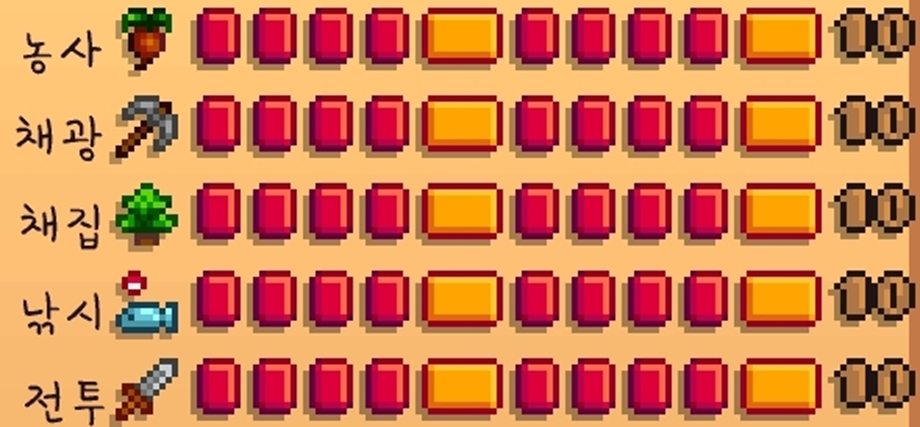
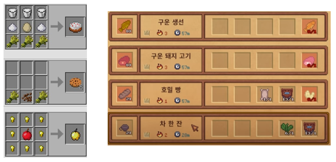
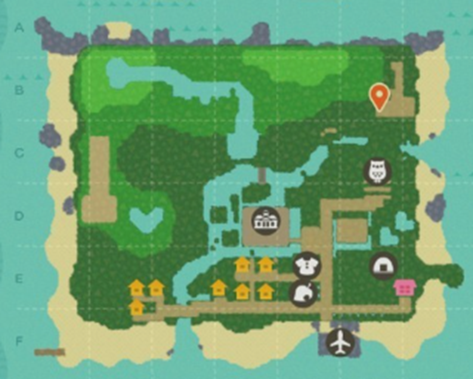
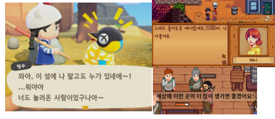
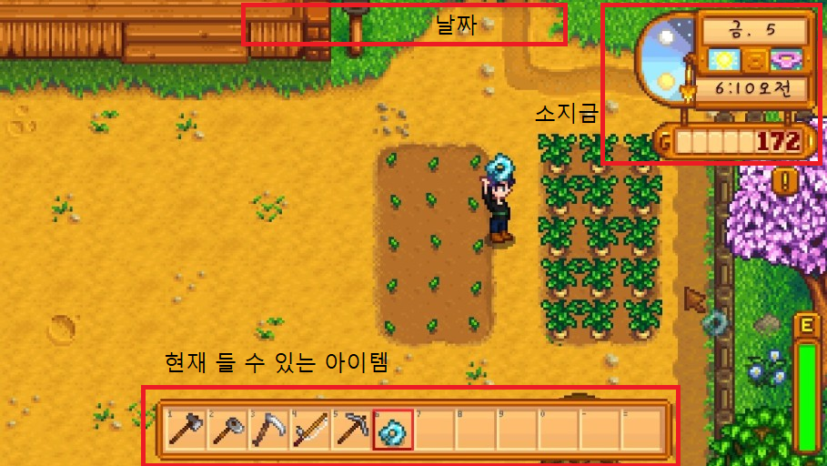

# 프로젝트명: 게임작품명

# [컨셉]

## 메인컨셉 :

- 다양한 활동으로 경제활동을 즐기며 돈을 벌어 살아가기

### 서브 컨셉 1 :

- 활동 : 농사, 낚시, 목축 등 다양한 방법으로 돈을 벌 수 있다.

### 서브 컨셉 2 :

- 성장 : 벌어 놓은 돈으로 도구나 집을 업그레이드하여 더욱 효율적인 생산을 할 수 있다.

### 서브 컨셉 3 :

- 조합 : 얻은 아이템을 조합하여 소비가치가 높은 아이템을 만들어서 돈을 번다.

### 서브 컨셉 4 :

- 맵 : 섬 안에서 내가 하고 싶은 일들을 자유롭게 다닐 수 있다.

### 서브 컨셉 5 :

- 마을주민 : 물건을 팔 수 있는 주민 뿐만 아니라 퀘스트를 받거나 대화 같은 상호작용을 할 수 있는 주민이 있다.

  

# [관련 이미지 & 동영상]

- 이미지  
  - 농사

  

  - 성장

  

  - 조합

  

  - 맵

  

  - 주민

  
- 동영상
  

  

# [대표 이미지]

  

# [컨셉 & 대표이미지 기반 작품묘사]

> ### 대표이미지 기반 :
> #### 화면구성
> #### - 상단에는 섬에 온 기점으로 플레이 타임을 알려주는 날짜를 보여줍니다
> #### - 오른쪽 상단에는 현재 돈을 얼마나 가지고 있는지 알려주는지 보여줍니다.
> #### - 하단에는 현재 사용할 수 있는 아이템을 보여줍니다. 

> ### 컨셉 기반: 
> #### 경제시뮬레이션이 메인컨셉으로 다양한 활동(농사,낚시 등)으로 돈을 벌어 섬에서 살아간다. 초반에는 아주 기본적이고 낡은 도구로 당장 할 수 있는 활동으로 돈을 벌다가 돈을 벌어 도구나 집을 업그레이드하고 주민으로부터 퀘스트를 받거나 섬을 탐험하여 섬에서 살아갑니다.

  

# [<게임제목> 구성 요소]

- ISLAND

 

## 1. 메커니즘

[도전 과제]

1. 다양한 활동으로 돈을 벌자

2. 물건을 업그레이드 해 효율적으로 돈을 벌자

3. 돈을 벌어서 아무것도 없던 곳을 꾸며보자

[재미 요소]

1. 다양한 활동, 농사, 낚시, 목축 등의 다양한 활동으로 지루하지 않게 즐길 수 있다.

2. 섬 탐험, 새로운 곳을 탐험하여 재미를 느낄 수 있다.

3. 꾸미기, 번 돈을 캐릭터나 집을 꾸밀 수 있다.

 

## 2. 이야기

육지에서 당신은 이름난 사업가였습니다. 지난 세월에 대한 보상으로 바다로 휴가를 나가게 됩니다. 하지만 갑자기 안 좋아지는 날씨에 파도에 휩쓸려 어떠한 섬에 도착하게 되는데 섬 주민의 도움으로 섬에 한 폐가에서 살아가게 됩니다. 섬에서 돈을 벌어서 살아갈 수 있을까요?

 

## 3. 미적요소

[배경] 섬을 배경으로 하여 4면이 바다인 섬을 배경

[음향] 플레이어의 걷는 소리, 환경음( 바다 파도 소리, 숲의 새소리, 풀 소리 등), 장소 별 bgm(마을-따뜻한 느낌, 폐가 - 잔잔한 느낌 등)

[캐릭터] 게임 시작에 캐릭터 외모 변경, 그 후 옷가게에서 옷을 사서 꾸미기

 

## 4. 기술

1. 물체의 움직임에 따라 애니메이션과 bgm으로 몰입감

2. Unity Tilemap을 활용한 맵 제작

3. pc 환경에 맞춰 제작 
